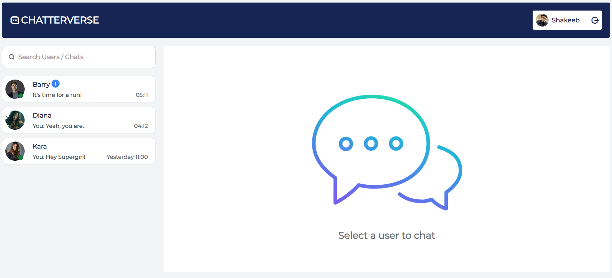

# ChatterVerse MERN Stack Project



<p align="center">
  <em>Where Conversations Come Alive</em>
</p>

Welcome to **ChatterVerse**, an interactive and real-time messaging platform built with the **MERN (MongoDB, Express, React, Node.js)** stack. 🚀💬 ChatterVerse provides users with a seamless and engaging chatting experience, offering features like real-time communication, image sharing, online status, read receipts, and more! 

## Key Features

- **Real-time Messaging**: Enjoy instant communication with friends and family through real-time messaging powered by **Socket.io**.

- **User Authentication**: Secure your conversations with our robust **JWT token-based authentication** system, ensuring only authorized users have access.

- **User Registration**: New users can easily create an account by providing necessary details and verifying their email.

- **User Profile**: Users can personalize their profiles by uploading a profile picture using **Cloudinary** integration.

- **Emoji Picker**: Express yourself with a wide range of emojis using the emoji picker built with **React**.

- **Image Sharing**: Share images directly within the chat to make your conversations more vibrant and interactive.

- **Online & Read Receipts**: Know when your friends are online and when they have read your messages.

## Technologies Used

- **Frontend**: React, Redux, React Router, Tailwind CSS, Remix Icons

- **Backend**: Node.js, Express.js

- **Database**: MongoDB Atlas

- **Authentication**: JWT (JSON Web Tokens)

- **Real-time Communication**: Socket.io

- **Image Storage**: Cloudinary

## [🌐 Live Demo](https://chatterverse-shark.onrender.com)

Experience ChatterVerse in action by visiting our live demo hosted on **Render**. Join the conversation and see for yourself the magic of real-time messaging!

## Deployment

To run ChatterVerse locally, follow these steps:

1. **Clone the repository**:
   ```
   git clone https://github.com/your-username/chatterverse-mern-stack.git
   ```

2. **Install the dependencies** for both the client and server:
   ```
   cd chatterverse-mern-stack/client
   npm install
   cd ../server
   npm install
   ```

3. **Set up the environment variables**:
   Create a `.env` file in the `server` folder and include the following variables:
   ```
   MONGODB_URI=your_mongodb_uri
   JWT_SECRET=your_jwt_secret
   CLOUDINARY_NAME=your_cloudinary_name
   CLOUDINARY_API_KEY=your_cloudinary_api_key
   CLOUDINARY_API_SECRET=your_cloudinary_api_secret
   ```

4. **Start the development server**:
   ```
   cd server
   npm run dev
   ```

5. **Visit `http://localhost:3000`** in your web browser to access Chatterverse.

## Contributing

We welcome contributions from the open-source community to enhance ChatterVerse further. If you find any bugs, have suggestions, or want to add new features, please submit a pull request.


## Acknowledgements

We extend our gratitude to the developers of the technologies used in this project, as well as the open-source community for their valuable contributions.

---

Thank you for choosing ChatterVerse! We hope you enjoy using it as much as we enjoyed building it. If you have any questions or need assistance, feel free to contact me at **shakeebparwez@gmail.com**.

Happy chatting! 😃🎉
